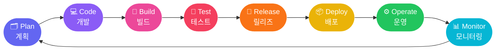
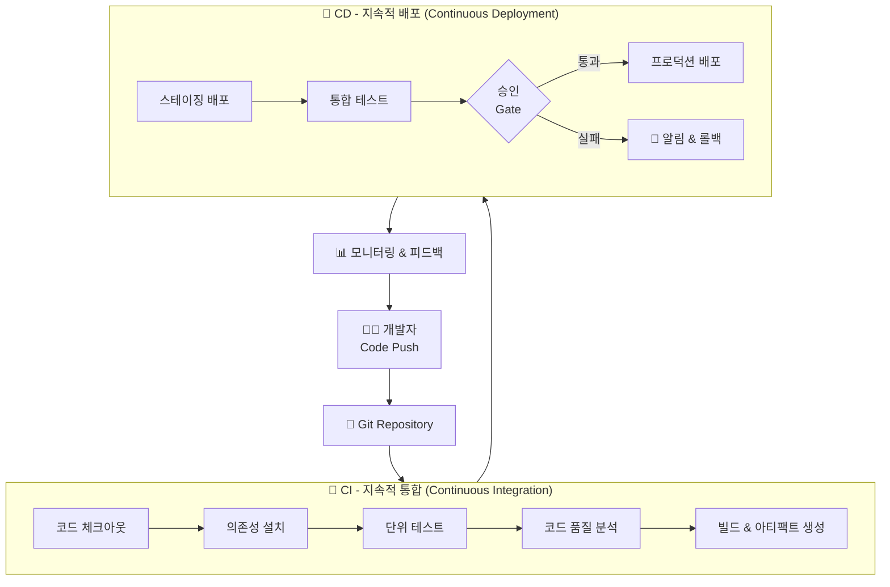
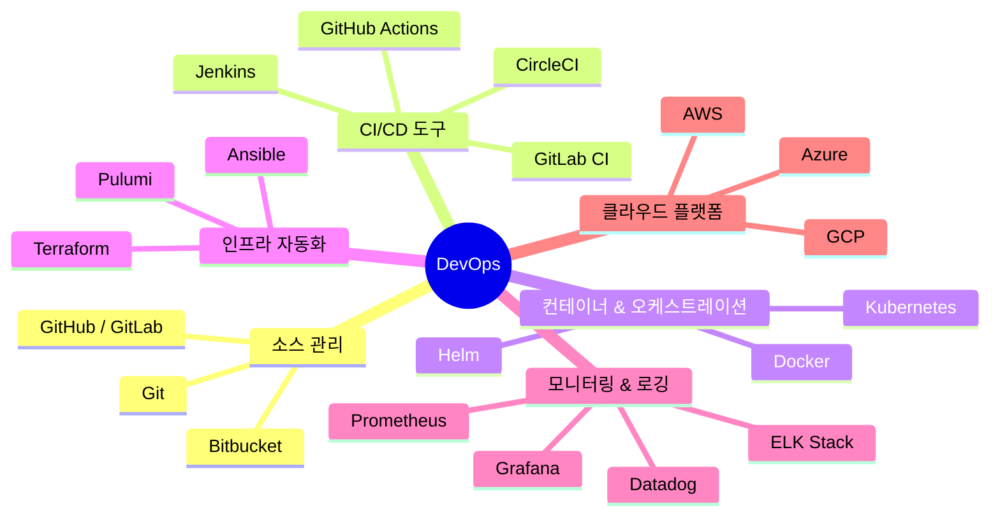
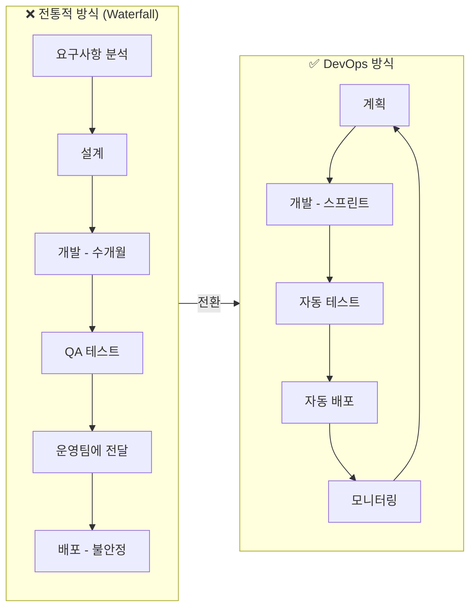
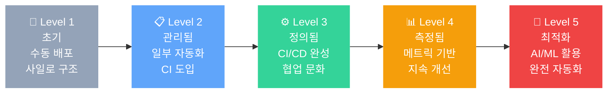
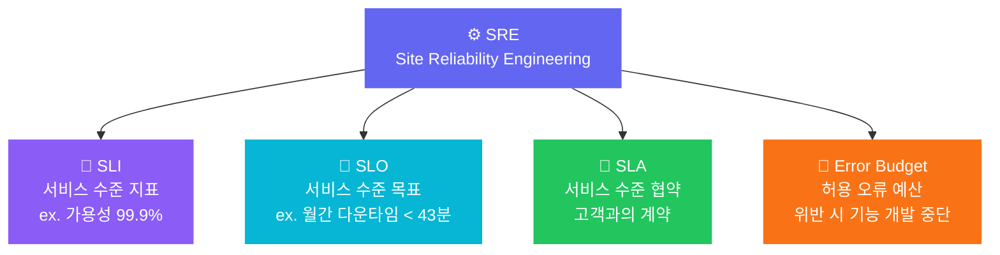

# DevOps 개요

> **DevOps**는 소프트웨어 개발(Development)과 IT 운영(Operations)을 통합하여, 더 빠르고 안정적인 소프트웨어 배포를 실현하는 문화·철학·방법론이다.

---

## 1. DevOps란 무엇인가?

DevOps는 단순한 도구나 기술이 아니라 **조직 문화의 변화**다. 개발팀과 운영팀 사이의 장벽을 허물고, 협업·자동화·지속적 개선을 통해 고품질 소프트웨어를 빠르게 제공하는 것을 목표로 한다.

### 핵심 가치 (CALMS)

| 항목 | 설명 |
|------|------|
| **C**ulture | 협업과 공유의 조직 문화 |
| **A**utomation | 반복 작업의 자동화 |
| **L**ean | 낭비 제거, 지속적 흐름 |
| **M**easurement | 측정과 데이터 기반 의사결정 |
| **S**haring | 지식·도구·책임의 공유 |

---

## 2. DevOps 무한 루프 (주요 흐름)

DevOps는 끝이 없는 **무한 루프(∞)** 구조로 이루어진다. 계획부터 모니터링까지의 사이클이 반복되며 지속적으로 개선된다.

---

## 3. CI/CD 파이프라인

DevOps의 핵심 실천법은 **CI/CD (지속적 통합 / 지속적 배포)** 파이프라인이다.

---

## 4. DevOps 주요 구성 요소

---

## 5. DevOps vs 전통적 개발 방식

---

## 6. DevOps 성숙도 모델

---

## 7. 핵심 메트릭 (DORA Metrics)

Google의 DevOps Research & Assessment(DORA) 팀이 정의한 4가지 핵심 지표:

| 메트릭 | 설명 | 엘리트 수준 |
|--------|------|------------|
| **배포 빈도** (Deployment Frequency) | 얼마나 자주 배포하는가 | 하루 여러 번 |
| **변경 리드타임** (Lead Time for Changes) | 코드 커밋 → 프로덕션 배포까지 시간 | 1시간 미만 |
| **변경 실패율** (Change Failure Rate) | 배포 후 장애 발생 비율 | 0~15% |
| **복구 시간** (Time to Restore) | 장애 발생 후 복구까지 시간 | 1시간 미만 |

---

## 8. SRE (Site Reliability Engineering)

SRE는 DevOps의 실천적 구현체로, Google이 제안한 운영 방법론이다.

---

## 9. DevOps 도입 시 고려사항

1. **문화부터 바꿔라** — 도구보다 조직 문화의 변화가 우선이다.
2. **작게 시작하라** — 한 팀, 한 파이프라인부터 시범 적용한다.
3. **측정하라** — DORA 메트릭을 기준으로 현재 수준을 파악한다.
4. **자동화하라** — 반복되는 수동 작업을 모두 자동화 대상으로 삼는다.
5. **피드백 루프를 짧게 유지하라** — 문제를 빠르게 발견하고 빠르게 수정한다.
6. **보안을 내재화하라 (DevSecOps)** — 보안을 파이프라인 처음부터 포함시킨다.

---
